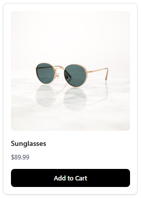
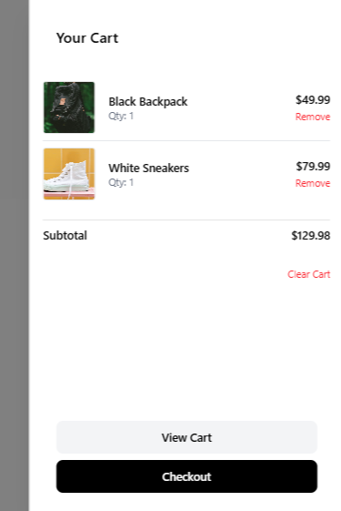
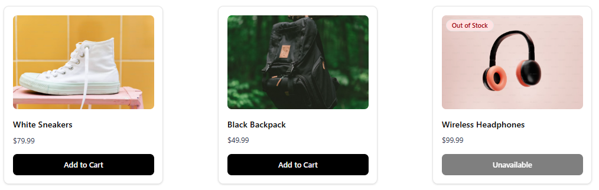

📦 Ecommerce UI Components
Reusable, accessible, and production-ready UI components for modern e-commerce apps — built with Next.js, shadcn/ui, Zustand, and Tailwind CSS.

✨ Features
♿ Accessible components

🛒 Fully functional MiniCart (add/remove/clear)

📦 Zustand store integration

📱 Responsive layout

💅 ShadCN + Tailwind styling

📖 Documented in Storybook

📚 Components included
Button (variant, loading, icon)

Badge (status labels)

ProductCard (image, stock state, add to cart)

ProductGrid (responsive layout)

Skeletons (loading states)

MiniCart (with Zustand)

Drawer implementation

🧪 Getting Started
bash
Copiar
Editar
git clone https://github.com/tuusuario/ecommerce-ui-components
cd ecommerce-ui-components
npm install
npm run dev     # Run Next.js
npm run storybook  # Open Storybook

---

### 📸 UI Preview

| Product Card | MiniCart (opened) |
|--------------|------------------|
|  |  |

| Product Grid | MiniCart Empty (Demo Items) |
|--------------|----------------------------|
|  | 

🛠 Tech Stack
Next.js

TypeScript

Tailwind CSS

shadcn/ui

Zustand

Storybook

💻 Use case
Ideal for portfolios, UI kits, or as a foundation for full e-commerce projects.